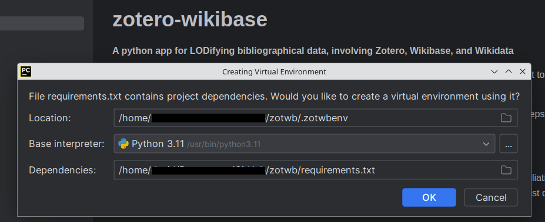
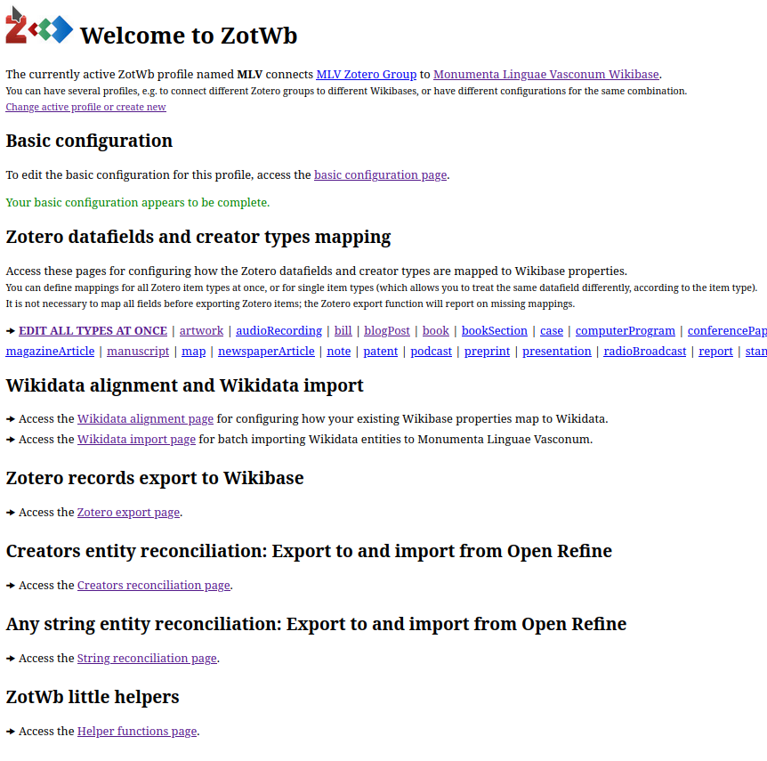
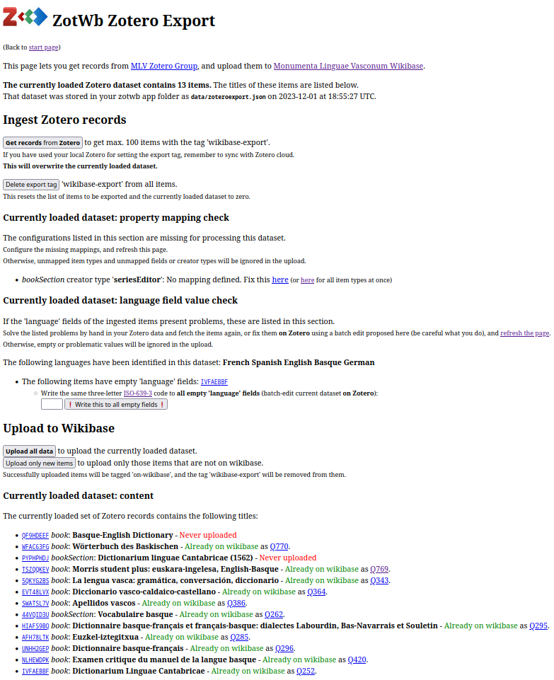
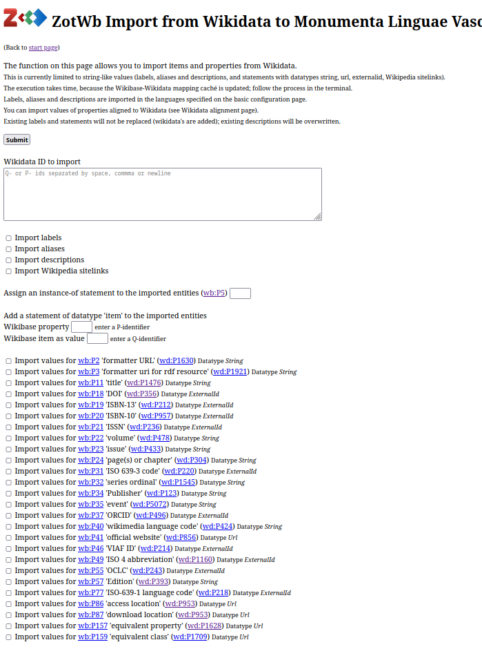

#   ZotWb 
 **A python app for LODifying bibliographical data, involving Zotero, Wikibase, and Wikidata**
 
This work is being supported by a [WMF Rapid Grant](https://meta.wikimedia.org/wiki/Grants:Programs/Wikimedia_Community_Fund/Rapid_Fund/Zotero_to_Wikibase_bibliographical_data_export_app_(ID:_22209513)).

This tool exports records in a Zotero group library to a custom Wikibase, prepares datasets to be sent to OpenRefine, and feeds OpenRefine reconciliaton results back to the Wikibase. Wikidata is envolved in the entity reconciliation.

It contains a range of functions for interaction with any Zotero group library and any Wikibase instance; some of them are potentially useful for any Zotero groups user (item batch edit, tag delete), and for any Wikibase user (Wikidata properties alignment, Import (cloning) of Wikidata entities).

**Zotero records are processed in the following way:**

The Zotero item type (e.g. 'book section' or 'journal article') and the publication language are by default LODified (i.e., represented as ontology items, not literals). Missing or unmapped language values are fixed on the fly by the user.

Creator names, or any 'string' property you specify are prepared for entity reconciliation using OpenRefine. Reconciliation results from Wikidata and/or from your own Wikibase (that makes sense if the entities you want to find already exist on your Wikibase) are accepted for re-feeding your Wikibase.

Identifiers (the Zotero Item ID, ISBN, ISSN, OCLC, and what you specify that my occur in the EXTRA field) are normalized and linked using 'external-id' properties.

A detailed documentation is given in the chapters in the [doc folder](doc), and also [on SSHOC Marketplace](https://marketplace.sshopencloud.eu/workflow/P0siWJ).

# Installation

This section explains what is necessary to start using ZotWb: 

* A Zotero account with read-and-write access to the Zotero group you want to export data from
  * You need a zotero user with read and write access to the Zotero group you want to use, a Zotero API key, and a Wikibase user with bot permissions and password.
  * A Zotero API key can be obtained [here](https://www.zotero.org/settings/keys/new). Be sure to grant read and write access through the key you create to the group library you want to export items from. The key consists of a single chain of characters.
* A Wikibase instance
  * You need a wikibase user account with bot permission, and its password.
* The Open Refine software (see the [Open Refine homepage](https://openrefine.org))

# Current limitations

This very first version of ZotWb was developed and tested on Ubuntu 23.10 Linux, and python 3.11. If you are on a different platform, install a virtual linux machine, and work on that. 
ZotWb includes a fork of A. Delpeuch's [OpenRefine-Wikibase](https://openrefine-wikibase.readthedocs.io/en/latest/index.html), which relies on the linux architecture and some linux packages.

ZotWb works out of the box for [Wikibase Cloud](https://wikibase.cloud) instances. For self-hosted Wikibases (Docker or manual install), the configuration file `config.json` (profile folder) will have to be manually edited (Please contact us for allowing the necessary configurations by default in a forthcoming version). 

# Installation steps
* ZotWb is a python3 Flask app. You need python3 installed, and the reconciliation engine needs the redis-server linux package.
* Create a [virtual environment](https://realpython.com/python-virtual-environments-a-primer/), and run all subsequent steps, and the tool itself, always inside that.
* Clone this repository to a place of your choice, ideally the same project folder your virtual environment was created in.
* The tool requires the installation of some python packages in your virtual environment. They are listed in 'requirements.txt'. the following packages; [install them in your virtual environment](https://realpython.com/python-virtual-environments-a-primer/#install-packages-into-it).

On debian-based systems like Ubuntu, commands that cover all this look as follows: 

```
sudo apt install git redis-server python3 virtualenv libpython3-dev
git clone https://github.com/dlindem/zotwb
cd zotwb
python3 -m venv .zotwbenv
source .zotwbenv/bin/activate
pip3 install -r requirements.txt
```

If the above steps have been successful, you should be able to run ZotWb with the following command in your terminal:

```
python3 -m zotwb
```

In subsequent sessions, you need to activate the virtual environment again, and start ZotWb:

```
cd zotwb
source .zotwbenv/bin/activate
python3 -m zotwb
```

You need to leave the terminal running. In the terminal, you can follow what ZotWb does by looking at the action log output displayed in the terminal. You can stop zotwb using CTRL+C in the terminal.

If ZotWb is running, point your browser to [http://127.0.0.1:5000/](http://127.0.0.1:5000/).

If you prefer to install, create the virtual environment and run ZotWb inside an application like [PyCharm](https://www.jetbrains.com/pycharm/download/?section=linux), after opening the cloned project folder, it looks like that:




# Configuration of the tool

ZotWb will guide you through the configuration process, which consists of the following steps:

* If you run ZotWb for the first time, the tool will ask you to create a profile. A profile is a set of configurations, including all necessary to access the Zotero group and the Wikibase instance you want to connect, and the definition of mappings (first and foremost, mappings between Zotero fields and Wikibase properties, but also between Wikibase and Wikidata.) You can define several profiles and switch between them.
* The tool will ask you to enter basic parameters
  * Zotero group to export data from (Zotero group ID, Zotero API key)
  * Wikibase to export data to (Wikibase name and URL, bot-user name and password)
    * Confidential information (usernames and passwords, API key) will be stored in a file called `config_private.json` inside your profile folder, and is by default included in `.gitignore`, so that there is no risk that you share this information in case you keep your ZotWb folder synced using git. This means, that if you use your ZotWb tool instance on various machines, you have to manually copy this file to the other machine, or re-do this configuration step inside the tool.
* Definition of basic ontology entities
  * Some basic properties, and items describing ontology classes need to be defined. During the process, the tool will ask you whether you want to create new entities, or use entities already existing on your Wikibase.
    * Examples for basic entities: "Wikidata Entity", a property of datatype "ExternalId" which points to the equivalent entity on Wikidata, or "instance of" (equivalent to rdf:type and wd:P31).
    * Examples for ontology classes: "Language", "Creator Role", or "BibItem type". Instances of these classes will be linked to their class using the "instance of" property.
* The mapping of Zotero creator types and Zotero data fields (one set of fields per BibItem type) is done when exporting data from Zotero, i.e., in the next step.
  * When you export data from Zotero, the tool checks if all BibItem types and all fields containing data in the set of records you are exporting are already mapped to Wikibase properties.
    * You can specify existing properties to use, or create new properties along the process.
    * You are able to define a Zotero-to-Wikibase mapping for all Zotero item types at once, and, alternatively, to map fields differently according to the BibItem type. For example, you may want to have titles of books mapped to a different property than titles of television broadcasts.

## Screenshots

This is how the starting page looks for a profile that connects to [MLV Wikibase](https://monumenta.wikibase.cloud). Another Wikibase where this tool is used is [LexBib Wikibase](https://lexbib.elex.is).



This is how the Zotero export page looks like:



This is how the Wikidata entity import function looks like:


